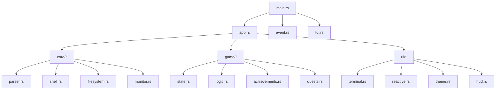

# 🔬 API Reference - Core Modules

Complete API documentation for Munux Reactive Workspace core components.

  

> [!NOTE]
> This document describes the internal API for v0.1.0. For architecture patterns, see [Architecture Overview](../architecture/overview.md).

---

## Module Organization



---

## Entry Point

### `main.rs`

Application entry point and event loop.

```rust
fn main() -> Result<()> {
    // Initialize terminal
    let mut terminal = tui::init()?;
    
    // Create app state
    let mut app = App::new();
    
    // Event loop (60Hz)
    loop {
        terminal.draw(|f| ui::render(&app, f))?;
        
        if let Event::Key(key) = event::read()? {
            app.handle_key(key)?;
        }
        
        if app.should_quit {
            break;
        }
    }
    
    tui::restore()?;
    Ok(())
}
```

**Responsibilities:**
- Terminal initialization/cleanup
- Event loop management
- Frame rendering (60 FPS)

---

## Application State

### `app.rs` - `App` struct

Central application state following The Elm Architecture.

```rust
pub struct App {
    // User input
    pub input: String,
    pub cursor_position: usize,
    
    // Command history
    pub history: Vec<String>,
    pub history_index: usize,
    
    // Terminal output
    pub output: Vec<String>,
    
    // Current directory
    pub current_dir: PathBuf,
    
    // Game state
    pub game_state: GameState,
    
    // UI state
    pub reactive_mode: ReactiveMode,
    pub should_quit: bool,
}
```

#### Key Methods

| Method | Signature | Purpose |
|:-------|:----------|:--------|
| `new()` | `fn new() -> Self` | Initialize with defaults |
| `handle_key()` | `fn handle_key(&mut self, key: KeyEvent) -> Result<()>` | Process keyboard input |
| `execute_command()` | `fn execute_command(&mut self, cmd: &str) -> Result<()>` | Run shell command |
| `add_output()` | `fn add_output(&mut self, text: String)` | Append to terminal output |
| `clear_screen()` | `fn clear_screen(&mut self)` | Clear terminal panel |

---

## Core Modules (`src/core/`)

### `parser.rs` - Command Classification

Analyzes commands and categorizes them using regex patterns.

```rust
pub enum CommandType {
    Navigation,      // cd, ls, pwd
    FileOps,        // touch, mkdir, cp, mv, rm
    TextProcessing, // cat, grep, sed, awk
    System,         // ps, top, htop, kill
    PackageManager, // pacman, apt, dnf, yay
    Network,        // ping, curl, wget, ssh
    Git,           // git commands
    Dangerous,     // rm -rf, dd, chmod 000
    Help,          // help, man
    EasterEgg,     // sl, cowsay, fortune
    Unknown,       // Unrecognized
}
```

#### API

```rust
impl Parser {
    /// Classify a command string
    pub fn classify(cmd: &str) -> CommandType;
    
    /// Calculate XP reward for command
    pub fn calculate_xp(cmd_type: &CommandType) -> u32;
    
    /// Check if command is dangerous
    pub fn is_dangerous(cmd: &str) -> bool;
    
    /// Extract command arguments
    pub fn parse_args(cmd: &str) -> Vec<String>;
}
```

**Example usage:**

```rust
let cmd_type = Parser::classify("pacman -Syu");
assert_eq!(cmd_type, CommandType::PackageManager);

let xp = Parser::calculate_xp(&cmd_type);
assert_eq!(xp, 50);
```

---

### `shell.rs` - Command Execution

Executes commands via system shell and captures output.

```rust
pub struct ShellExecutor;

impl ShellExecutor {
    /// Execute command and return output
    pub fn execute(cmd: &str) -> Result<ExecutionResult>;
    
    /// Execute with custom working directory
    pub fn execute_in_dir(cmd: &str, dir: &Path) -> Result<ExecutionResult>;
    
    /// Execute and stream output (for long-running commands)
    pub fn execute_stream<F>(cmd: &str, callback: F) -> Result<()>
        where F: FnMut(String);
}

pub struct ExecutionResult {
    pub stdout: String,
    pub stderr: String,
    pub exit_code: i32,
    pub duration: Duration,
}
```

> [!WARNING]
> All commands run via `sh -c`. Ensure proper shell escaping for user input!

---

### `filesystem.rs` - File Operations

Safe file system navigation and reading.

```rust
pub struct FileSystem;

impl FileSystem {
    /// List directory contents
    pub fn list_dir(path: &Path) -> Result<Vec<DirEntry>>;
    
    /// Read file contents (with size limit)
    pub fn read_file(path: &Path, max_bytes: usize) -> Result<String>;
    
    /// Check if path exists and type
    pub fn get_file_type(path: &Path) -> Result<FileType>;
    
    /// Get file metadata
    pub fn get_metadata(path: &Path) -> Result<Metadata>;
    
    /// Navigate to directory (validates path)
    pub fn change_dir(current: &Path, target: &str) -> Result<PathBuf>;
}

pub struct DirEntry {
    pub name: String,
    pub is_dir: bool,
    pub size: u64,
    pub permissions: String,
}
```

**Safety guarantees:**
- ✅ Validates paths before access
- ✅ Respects Linux permissions
- ✅ Limits file read size (prevents OOM on large files)
- ✅ No unsafe code

---

### `monitor.rs` - System Metrics

Real-time system monitoring using `sysinfo` crate.

```rust
pub struct SystemMonitor {
    system: System,
}

impl SystemMonitor {
    /// Create new monitor instance
    pub fn new() -> Self;
    
    /// Refresh all metrics
    pub fn refresh(&mut self);
    
    /// Get CPU usage (0.0 - 100.0)
    pub fn cpu_usage(&self) -> f32;
    
    /// Get memory usage
    pub fn memory_usage(&self) -> MemoryInfo;
    
    /// Get swap usage
    pub fn swap_usage(&self) -> MemoryInfo;
    
    /// Get process count
    pub fn process_count(&self) -> usize;
}

pub struct MemoryInfo {
    pub used: u64,      // Bytes
    pub total: u64,     // Bytes
    pub percentage: f32, // 0.0 - 100.0
}
```

**Performance:**
- Refresh rate: Configurable (default 1s)
- Memory footprint: ~2 MB
- CPU overhead: <0.5%

---

## Game Modules (`src/game/`)

### `state.rs` - Game State

Persistent game progression tracking.

```rust
pub struct GameState {
    pub level: u32,
    pub xp: u32,
    pub total_commands: u32,
    pub successful_commands: u32,
    pub current_streak: u32,
    pub max_streak: u32,
    pub achievements: Vec<Achievement>,
    pub active_quests: Vec<Quest>,
}

impl GameState {
    /// Calculate XP needed for next level
    pub fn xp_for_next_level(&self) -> u32 {
        100 * self.level
    }
    
    /// Add XP and check for level up
    pub fn add_xp(&mut self, amount: u32) -> Option<LevelUpInfo>;
    
    /// Check and unlock achievements
    pub fn check_achievements(&mut self, cmd_type: &CommandType) -> Vec<Achievement>;
    
    /// Update quests progress
    pub fn update_quests(&mut self, cmd: &str) -> Vec<Quest>;
    
    /// Increment or break streak
    pub fn update_streak(&mut self, success: bool);
    
    /// Get current tier
    pub fn get_tier(&self) -> Tier;
}
```

---

### `logic.rs` - Game Logic

Pure functions for game calculations.

```rust
pub struct GameLogic;

impl GameLogic {
    /// Calculate level from XP
    pub fn level_from_xp(xp: u32) -> u32;
    
    /// Calculate tier from level
    pub fn tier_from_level(level: u32) -> Tier;
    
    /// Apply streak multiplier to XP
    pub fn apply_multiplier(base_xp: u32, streak: u32) -> u32;
    
    /// Calculate success rate
    pub fn success_rate(successful: u32, total: u32) -> f32;
}

pub enum Tier {
    Beginner,   // 1-9
    Terminal,   // 10-19
    Hacker,     // 20-29
    Cyberpunk,  // 30-39
    Elite,      // 40-49
    Legend,     // 50+
}
```

> [!TIP]
> All functions are **pure** (no side effects) for easy testing!

---

### `achievements.rs` - Achievement System

```rust
pub struct Achievement {
    pub id: String,
    pub title: String,
    pub description: String,
    pub icon: String,
    pub xp_reward: u32,
    pub unlocked: bool,
    pub unlock_time: Option<DateTime<Utc>>,
}

impl Achievement {
    /// Check if achievement trigger condition is met
    pub fn check_trigger(&self, state: &GameState, cmd_type: &CommandType) -> bool;
    
    /// Unlock achievement
    pub fn unlock(&mut self) -> u32; // Returns XP reward
}

/// Predefined achievements
pub fn get_all_achievements() -> Vec<Achievement>;
```

**Total achievements:** 25+

---

### `quests.rs` - Quest System

```rust
pub struct Quest {
    pub id: String,
    pub title: String,
    pub description: String,
    pub progress: u32,
    pub target: u32,
    pub xp_reward: u32,
}

impl Quest {
    /// Update progress based on command
    pub fn update(&mut self, cmd: &str) -> bool; // Returns true if completed
    
    /// Check if quest is complete
    pub fn is_complete(&self) -> bool {
        self.progress >= self.target
    }
}

/// Generate level-appropriate quests
pub fn generate_quests(level: u32) -> Vec<Quest>;
```

---

## UI Modules (`src/ui/`)

### `theme.rs` - Theme System

Progressive themes based on player level.

```rust
pub struct Theme {
    pub name: String,
    pub primary: Color,
    pub secondary: Color,
    pub accent: Color,
    pub success: Color,
    pub danger: Color,
    pub text: Color,
}

impl Theme {
    /// Get theme for current tier
    pub fn for_tier(tier: &Tier) -> Self;
    
    /// Get all available themes
    pub fn all_themes() -> Vec<Self>;
}
```

**Available themes:**
- 🌱 Cyan Dreams (Beginner)
- 💻 Matrix Vision (Terminal)
- 🔓 Cyber Pulse (Hacker)
- 🌃 Night City (Cyberpunk)
- 👑 Royal Court (Elite)
- ⭐ Legend Mode (Legend)

---

### `reactive.rs` - Reactive Panel Modes

```rust
pub enum ReactiveMode {
    Welcome,
    FileTree,
    FilePreview(PathBuf),
    ResourceMonitor,
    DangerZone(String),
    Stats,
    Quests,
    Help(String),
    EasterEgg(String),
}

impl ReactiveMode {
    /// Determine mode from user input
    pub fn from_input(input: &str, app: &App) -> Self;
    
    /// Render mode-specific content
    pub fn render(&self, frame: &mut Frame, area: Rect);
}
```

---

### `terminal.rs` - Terminal Panel

```rust
pub fn render_terminal_panel(app: &App, frame: &mut Frame, area: Rect);
```

Displays:
- Command prompt
- Command history
- Output from executed commands
- Syntax highlighting

---

### `hud.rs` - Heads-Up Display

```rust
pub fn render_hud(app: &App, frame: &mut Frame, area: Rect);
```

Shows:
- Current level and tier
- XP progress bar
- Achievement count
- Streak counter
- System integrity

---

## Event Handling

### `event.rs`

```rust
pub enum Event {
    Key(KeyEvent),
    Resize(u16, u16),
    Tick,
}

/// Read next event (blocking)
pub fn read() -> Result<Event>;

/// Read with timeout
pub fn read_timeout(duration: Duration) -> Result<Option<Event>>;
```

---

## Terminal Management

### `tui.rs`

```rust
/// Initialize terminal for TUI mode
pub fn init() -> Result<Terminal<CrosstermBackend<Stdout>>>;

/// Restore terminal to normal mode
pub fn restore() -> Result<()>;
```

---

## Testing Utilities

> [!TIP]
> See [TESTING.md](../TESTING.md) for detailed testing guide.

```rust
#[cfg(test)]
mod tests {
    use super::*;
    
    #[test]
    fn test_xp_calculation() {
        let xp = Parser::calculate_xp(&CommandType::PackageManager);
        assert_eq!(xp, 50);
    }
    
    #[test]
    fn test_level_progression() {
        let mut state = GameState::new();
        state.add_xp(100);
        assert_eq!(state.level, 2);
    }
}
```

---

## Error Handling

All public APIs use `Result<T, Error>` where `Error` is from `anyhow` crate.

```rust
use anyhow::{Result, Context, bail};

pub fn risky_operation() -> Result<()> {
    some_operation()
        .context("Failed to execute operation")?;
    Ok(())
}
```

---

## Performance Considerations

| Module | Time Complexity | Space Complexity |
|:-------|:----------------|:-----------------|
| `parser::classify()` | O(n) | O(1) |
| `shell::execute()` | O(cmd_runtime) | O(output_size) |
| `filesystem::list_dir()` | O(n) | O(n) |
| `monitor::refresh()` | O(1) | O(1) |
| `game::add_xp()` | O(1) | O(1) |

> [!NOTE]
> No operations block the UI thread. Long-running commands run in separate processes.

---

## Next Steps

- 🏗️ [Architecture Overview](../architecture/overview.md) - Design patterns and philosophy
- 🧪 [Testing Guide](../TESTING.md) - How to test components
- 🤝 [Contributing](../contributing/code-of-conduct.md) - Submit improvements

**Happy coding!** 🦀✨
