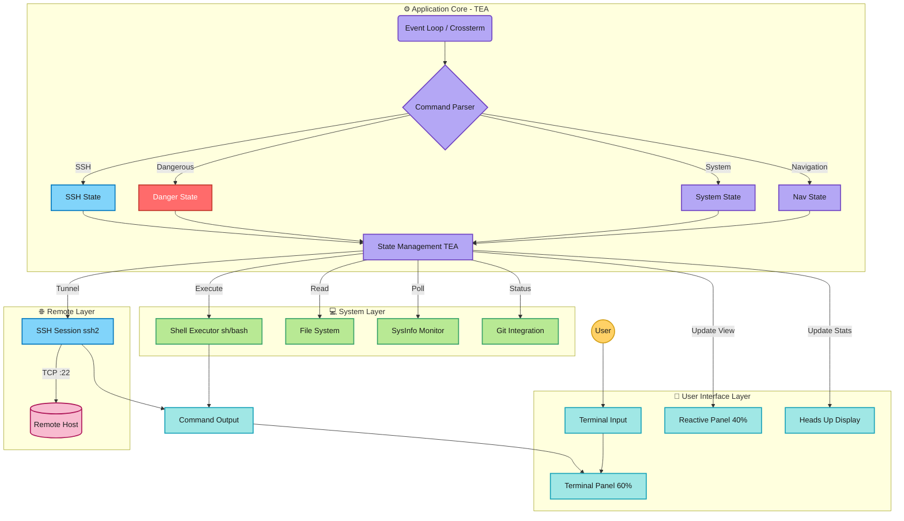
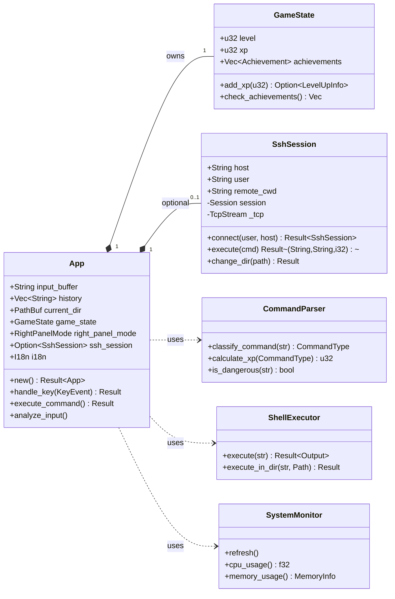
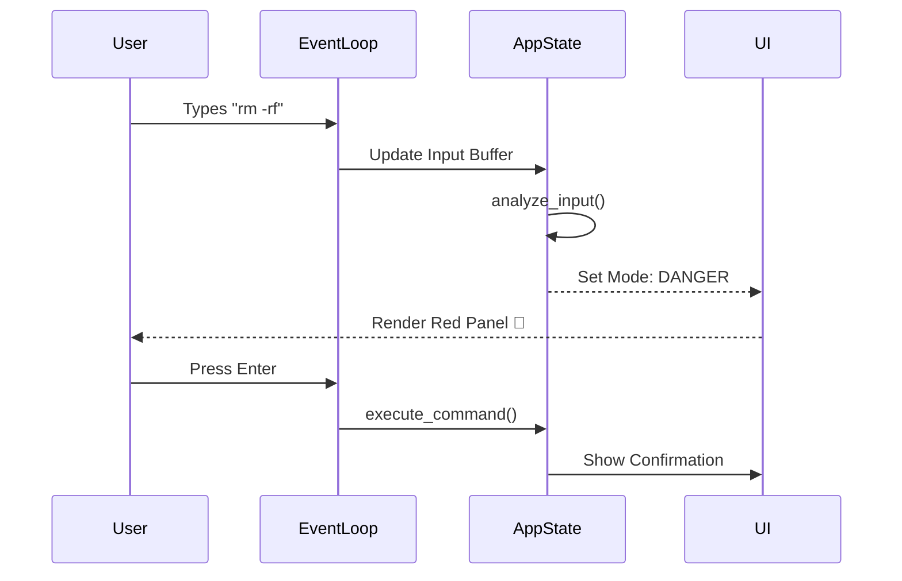
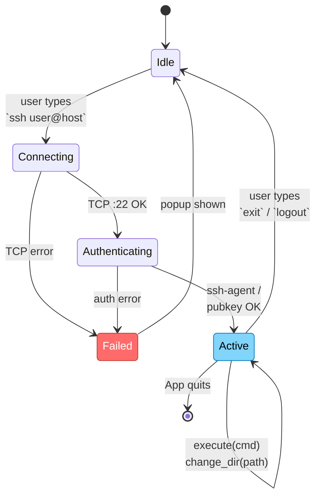
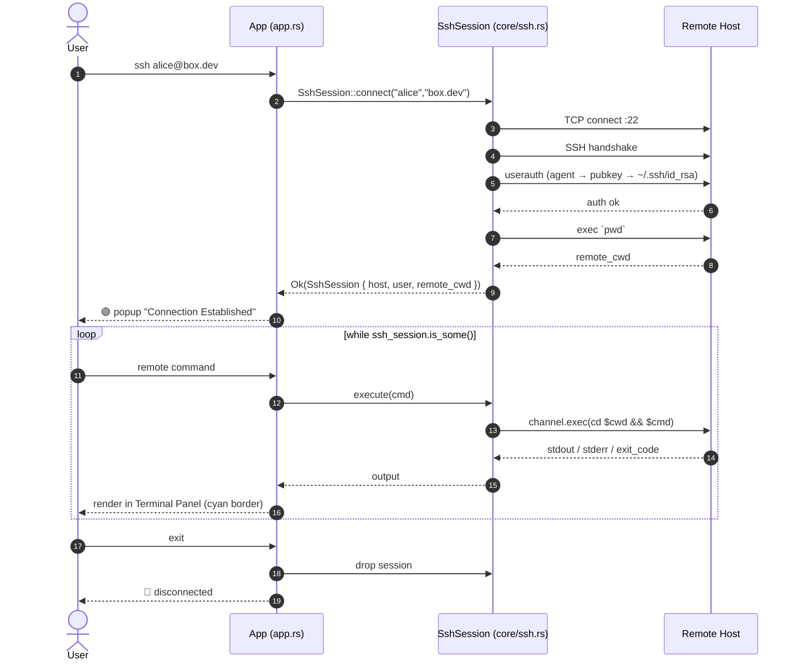
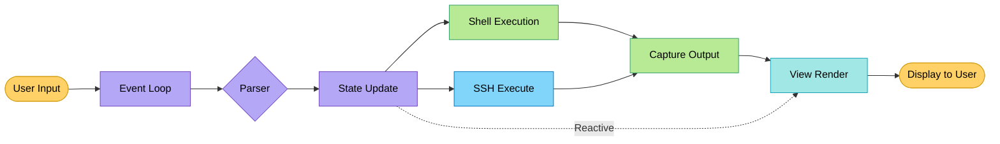
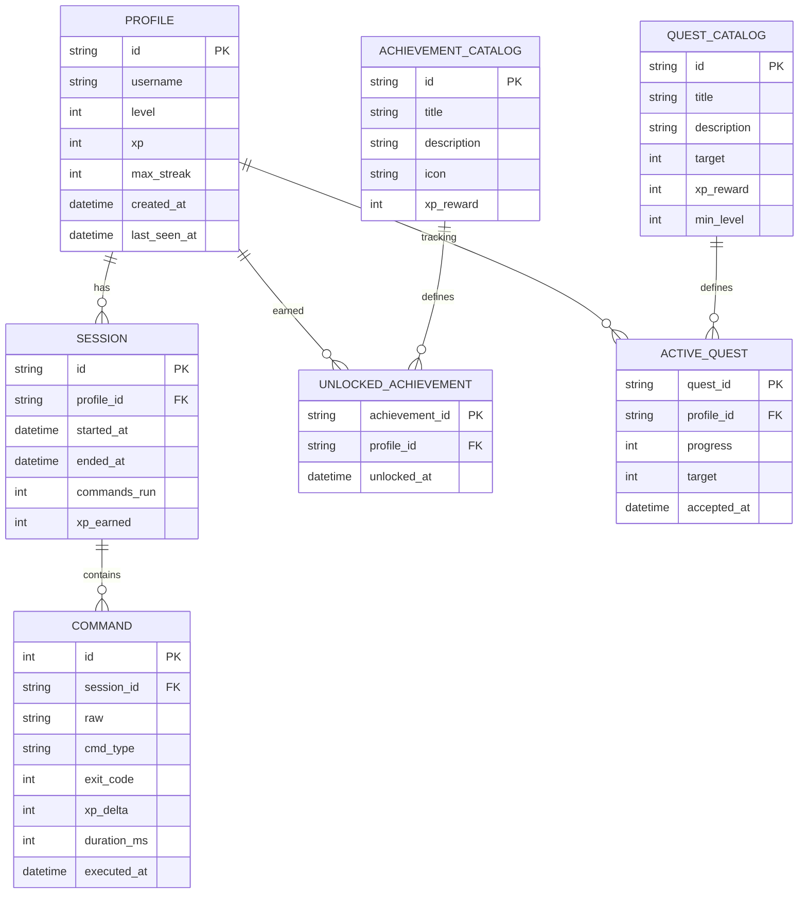

# 🏗️ Architecture Overview

> [!NOTE]
> This document describes the high-level design of Munux v0.1.0. For implementation details, see the API reference in [core-modules.md](../api/core-modules.md).

## Executive Summary

Munux implements a **reactive split-panel architecture** based on **The Elm Architecture (TEA)**. It combines the raw power of a Unix shell with an intelligent, state-aware UI layer that provides real-time context and gamification.

---

## High-Level Architecture



> [!TIP]
> 🟨 User · 🟦 UI · 🟪 Core · 🟩 System · 🟦 SSH · 🟥 Danger — color-coded for fast scanning.

---

## Core Class Diagram (UML)



---

## Design Patterns

### 1. The Elm Architecture (TEA)

Munux ensures predictable state management through a unidirectional data flow.

```rust
// Model - Single source of truth
struct App { 
    state: State 
}

// Update - Pure state transformations
fn update(msg: Msg, model: &mut App) -> Command

// View - Immutable rendering
fn view(model: &App) -> Frame
```

> [!TIP]
> **Why TEA?** This pattern makes the application incredibly easy to debug. Since the view is a pure function of the state, we can reproduce any visual bug just by knowing the state data.

---

### 2. Strategy Pattern (Command Classification)

We categorize user input into 11 distinct strategies to determine UI reaction.

| Strategy | Trigger | UI Reaction |
|----------|---------|-------------|
| **Navigation** | `cd`, `ls`, `pwd` | File Tree visualization |
| **File Operations** | `touch`, `mkdir`, `cp` | File preview panel |
| **Monitoring** | `top`, `ps`, `htop` | Real-time graphs (CPU/RAM) |
| **Package Mgmt** | `pacman`, `apt`, `dnf` | Installation progress |
| **Network** | `ping`, `curl`, `wget` | Network status |
| **Dangerous** | `rm -rf`, `dd`, `sudo` | 🚨 Red Warning Panel |
| **Git** | `git` commands | Repository status |
| **Text Processing** | `cat`, `grep`, `sed` | Content preview |
| **Help** | `help`, `man` | Documentation viewer |
| **Easter Eggs** | `sl`, `cowsay`, `fortune` | Special animations |
| **Unknown** | Unrecognized | Suggestion system |

Each strategy determines: **XP reward**, **reactive panel mode**, and **achievement triggers**.

---

### 3. Observer Pattern (Reactive Panels)

The Right Panel "observes" the input buffer. As you type (before pressing Enter), the UI reacts.



---

## Component Breakdown

| Component | File | Responsibility |
|-----------|------|----------------|
| **Event Loop** | `event.rs` | Keyboard input (Crossterm), resize events, 60Hz polling |
| **App State** | `app.rs` | Game state (XP, level, achievements), command history |
| **Parser** | `core/parser.rs` | Command classification (regex), XP calculation, danger detection |
| **Shell Executor** | `core/shell.rs` | Executes via `sh -c`, captures stdout/stderr |
| **File System** | `core/filesystem.rs` | Directory listing, file preview, navigation |
| **Monitor** | `core/monitor.rs` | Real-time CPU/RAM/Swap metrics (SysInfo) |
| **Terminal Panel** | `ui/terminal.rs` | Left panel - command output display |
| **Reactive Panel** | `ui/reactive.rs` | Right panel - context-aware modes (9 types) |
| **HUD** | `ui/hud.rs` | Bottom bar - XP, level, streak, integrity |
| **Theme System** | `ui/theme.rs` | Progressive themes (6 tiers: Beginner→Legend) |
| **Stats Panel** | `ui/stats.rs` | Detailed statistics and quest tracking |
| **Popup System** | `ui/popup.rs` | Achievement notifications, warnings |
| **SSH Session** | `core/ssh.rs` | Remote shell via `ssh2` (agent / pubkey auth), remote cwd tracking |
| **Git Integration** | `core/git.rs` | Repository branch/status detection |
| **I18n** | `i18n.rs` | Runtime localization (EN / PT-BR) via Fluent |

---

## SSH Session Lifecycle (State Diagram)



### SSH Command Flow (Sequence)



---

## Data Flow



**Step-by-step:**
1. 🎹 User types command
2. 🔄 Event loop captures input (Crossterm)
3. 🔍 Parser classifies command type
4. 💾 State updated (XP, achievements, quests)
5. 🐚 Command executed via shell (`sh -c`)
6. 📋 Output captured (stdout/stderr)
7. 🎨 UI re-rendered based on new state
8. 🖥️ Display updates (60Hz refresh)

---

## Security Model

> [!WARNING]
> **Safety First**: Munux creates a safety layer, but actual commands are executed on the host system.

| Layer | Protection |
|-------|-----------|
| **Dangerous Command Detection** | Pattern matching intercepts `rm`, `dd`, `chmod` before execution |
| **Shell Isolation** | Commands run in isolated `sh -c` instances |
| **Permissions** | Munux respects standard Linux User/Group permissions |
| **No Privilege Escalation** | Never attempts to gain root access automatically |
| **Confirmation Dialogs** | Red warning panel + explicit confirmation for destructive ops |
| **State Isolation** | XP/achievements stored in memory only (no persistence) |

### File System Access
✅ Respects standard Linux permissions  
✅ Uses safe Rust APIs (no unsafe blocks)  
✅ Clean exit on `Ctrl+C` with terminal restoration

---

## Performance Characteristics

| Metric | Value | Notes |
|--------|-------|-------|
| **Refresh Rate** | 60 Hz | Event loop polling frequency |
| **Memory Usage** | ~10-20 MB | Typical runtime footprint |
| **CPU (Idle)** | <1% | Minimal background processing |
| **CPU (Active)** | Spikes during execution | Shell commands inherit system load |
| **Startup Time** | <200ms | Release build cold start |

> [!TIP]
> Always use `cargo run --release` for production usage. Debug builds are 10-50x slower due to runtime checks.

---

## Future Enhancements

### 🗂️ Persistence Layer
- [ ] Save XP and achievements to `~/.munux/state.json`
- [ ] Command history across sessions (SQLite)
- [ ] Cloud sync for multi-device progression

#### Proposed Data Model (ER)

> [!NOTE]
> Not implemented yet. Sketch for the upcoming `~/.munux/state.json` (JSON) + `~/.munux/history.db` (SQLite) split.



**Storage strategy:**
- 🟨 `state.json` → `PROFILE`, `UNLOCKED_ACHIEVEMENT`, `ACTIVE_QUEST` (small, human-readable, edited atomically).
- 🟦 `history.db` (SQLite) → `SESSION`, `COMMAND` (append-heavy, indexed by `executed_at`).
- 🟩 Catalogs (`ACHIEVEMENT_CATALOG`, `QUEST_CATALOG`) are compiled-in at build time, not persisted.

### 🌐 Network Features
- [x] ✅ **SSH integration** with reactive terminal view (via `ssh2`, v0.1.1+)
- [ ] Interactive password auth (currently agent + pubkey only)
- [ ] Remote system monitoring over SSH tunnels
- [ ] Distributed quest completion (team challenges)

### 🔌 Plugin System
- [ ] Custom command handlers via WASM
- [ ] User-defined achievements (Lua scripting)
- [ ] Theme marketplace

### 🤖 AI Assistance
- [ ] Command suggestions based on context (LLM integration)
- [ ] Error explanation and auto-fixes
- [ ] Natural language to shell translation

---

## Next Steps

- 📖 Read [Component API Reference](../api/core-modules.md)
- 🔧 Check [Build Process](../../README.md#installation)
- 🎮 Explore [Gamification Mechanics](../guides/gamification-system.md)
