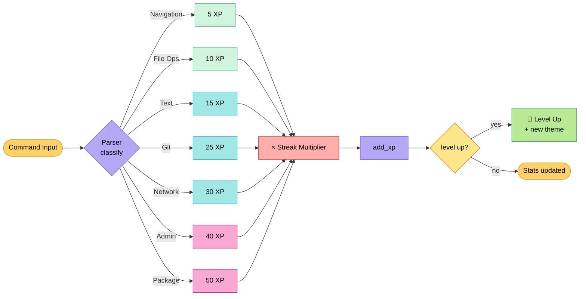
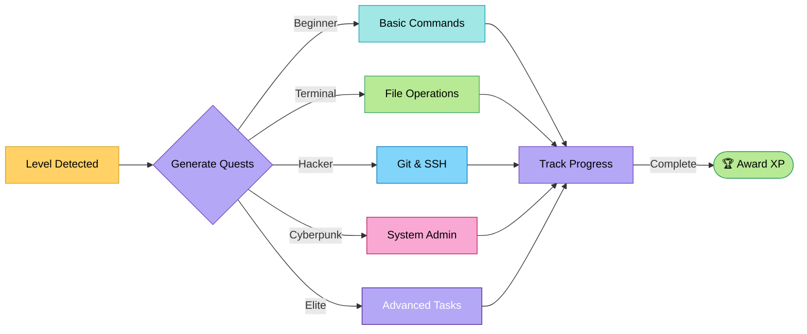

# 🎮 Gamification System

> [!IMPORTANT]
> Gamification in Munux is designed to reinforce learning, not distract from it. All mechanics incentivize correct CLI usage and exploration.

## The 4 Pillars of Progression

Munux transforms terminal usage into an RPG experience using four core mechanics:

1. **Experience Points (XP)** - Earned by executing commands
2. **Levels & Tiers** - Unlock visual customization and tools
3. **Achievements** - Badges for specific milestones
4. **Streaks** - Multipliers for consistency

---

## 🏗️ Experience Points (XP)

XP is calculated dynamically based on the complexity of the operation.

$$\text{Total XP} = (\text{Base Command XP}) \times (\text{Streak Multiplier})$$

### XP Pipeline (colored flow)



### XP Values Table

| Command Type | Base XP | Context |
|:-------------|:-------:|:--------|
| **Navigation** | `5 XP` | `cd`, `ls`, `pwd` |
| **File Ops** | `10 XP` | `mkdir`, `touch`, `cp` |
| **Text Processing** | `15 XP` | `grep`, `sed`, `awk` |
| **Git** | `25 XP` | `git commit`, `git push` |
| **Git Sync** | `10 XP` | Refreshing ahead/behind status |
| **Network** | `30 XP` | `ping`, `curl`, `ssh` |
| **Admin** | `40 XP` | `systemctl`, `journalctl` |
| **Package Mgr** | `50 XP` | `pacman`, `apt`, `dnf` |
| **Dangerous** | `25 XP` | Correct usage of `rm` or `sudo` |

> [!NOTE]
> Dangerous commands give XP **only** if used correctly. Destructive errors penalize your streak!

---

## 🏆 Level Progression

> [!NOTE]
> Leveling up unlocks new themes for the UI and evolves your **Tux Avatar**.

| Level | Tier Name | Visual Identity | Unlocks |
|:-----:|:----------|:----------------|:--------|
| **1-9** | 🌱 **Beginner** | Cyan Theme | Basic Commands |
| **10-19** | 💻 **Terminal** | Matrix Green | File Manipulation |
| **20-29** | 🔓 **Hacker** | Hacker Cyan | Text Editors (`nano`/`vim`) |
| **30-39** | 🌃 **Cyberpunk** | Cyberpunk Magenta | Git & Networking |
| **40-49** | 👑 **Elite** | Elite Purple | Docker & Containers |
| **50+** | ⭐ **Legend** | Rainbow/RGB | **God Mode** |

### Tier State Machine

```mermaid
stateDiagram-v2
    direction LR
    [*] --> Beginner
    Beginner --> Terminal : level ≥ 10
    Terminal --> Hacker : level ≥ 20
    Hacker --> Cyberpunk : level ≥ 30
    Cyberpunk --> Elite : level ≥ 40
    Elite --> Legend : level ≥ 50
    Legend --> [*] : master 🏆

    classDef beg fill:#a0e7e5,stroke:#17a2b8,color:#000
    classDef term fill:#b8e994,stroke:#38a169,color:#000
    classDef hack fill:#81d4fa,stroke:#0277bd,color:#000
    classDef cyber fill:#f9a8d4,stroke:#be185d,color:#000
    classDef elite fill:#b4a7f5,stroke:#6f42c1,color:#000
    classDef leg fill:#ffd166,stroke:#d4a017,color:#000
    class Beginner beg
    class Terminal term
    class Hacker hack
    class Cyberpunk cyber
    class Elite elite
    class Legend leg
```



### Level Up Rewards

Each tier grants:

- 🎨 **New Theme** - Visual evolution of UI colors
- 🐧 **Tux Evolution** - ASCII art transformation
- ⚡ **Symbol Change** - Unique command prompt icon
- 🏆 **Milestone Badge** - Permanent achievement

---

## 🏅 Achievements

Achievements provide large bursts of XP and unique badges displayed in your profile.

### Category: Package Managers

*Designed to encourage distro-agnostic learning.*

| Badge | Title | Trigger | Reward |
|:-----:|:------|:--------|:------:|
| 🏔️ | **Arch User** | Use `pacman` | `50 XP` |
| 📦 | **Debian Disciple** | Use `apt` | `50 XP` |
| 🎩 | **Fedora Faithful** | Use `dnf` | `50 XP` |
| 🦎 | **OpenSUSE Fan** | Use `zypper` | `50 XP` |
| 📦 | **Flatpak Explorer** | Use `flatpak` | `50 XP` |

### Category: First Steps

*Fundamental CLI operations.*

| Badge | Title | Trigger | Reward |
|:-----:|:------|:--------|:------:|
| 🎯 | **First Command** | Execute any command | `10 XP` |
| 📁 | **Navigator** | Use `cd` | `20 XP` |
| 👀 | **Observer** | Use `ls` | `20 XP` |
| ✏️ | **Creator** | Create file with `touch` | `30 XP` |
| 🗑️ | **Destroyer** | Use `rm` safely | `30 XP` |
| 🔐 | **Superuser** | First `sudo` command | `40 XP` |

### Category: Milestones

*Long-term commitment tracking.*

| Badge | Title | Trigger | Reward |
|:-----:|:------|:--------|:------:|
| 🎯 | **Getting Started** | 10 commands executed | `50 XP` |
| 🚀 | **Regular User** | 50 commands executed | `100 XP` |
| 💎 | **Power User** | 100 commands executed | `200 XP` |
| 👑 | **Terminal Master** | 500 commands executed | `500 XP` |

### Category: Streaks

*Designed to build consistency.*

| Badge | Title | Trigger | Reward |
|:-----:|:------|:--------|:------:|
| 🔥 | **On Fire!** | 5 commands without errors | `1.2x` multiplier |
| 🔥🔥 | **Unstoppable!** | 10 commands without errors | `1.5x` multiplier |
| 🔥🔥🔥 | **LEGENDARY!** | 25 commands without errors | `2.0x` multiplier |

> [!TIP]
> Use the command `stats` at any time to view your unlocked badges and current streak multiplier.

---

## ⚔️ Quest System

Quests are procedurally generated missions based on your current level.



### Quest Examples by Tier

| Tier | Quest Examples |
|:-----|:--------------|
| 🌱 **Beginner** | "Execute your first `ls`", "Create a file with `touch`", "Navigate to /home" |
| 💻 **Terminal** | "Use `grep` to find text", "Install a package", "Check disk usage with `df`" |
| 🔓 **Hacker** | "Configure Git", "Use SSH to connect", "Create a symbolic link" |
| 🌃 **Cyberpunk** | "Compile a program", "Create a systemd service", "Use `tmux` or `screen`" |
| 👑 **Elite** | "Write a shell script", "Optimize kernel parameters", "Set up a firewall" |
| ⭐ **Legend** | "Master of all commands!" (No more quests - you are the master!) |

**How it works:**

1. The system monitors your command `history`
2. When a quest criteria is met, a notification toast appears
3. XP is awarded immediately
4. New quests are generated automatically

> [!NOTE]
> Press `Q` key at any time to view your active quest log.

---

## 🔥 Streak System

Streaks track consecutive successful commands (no errors).

| Streak | Multiplier | Visual Effect |
|:------:|:----------:|:--------------|
| 0-4 | `1.0x` | Normal |
| 5-9 | `1.2x` | 🔥 Fire icon |
| 10-24 | `1.5x` | 🔥🔥 Double fire |
| 25+ | `2.0x` | 🔥🔥🔥 **GODLIKE** |

**Streak Breaks:**

- ❌ Command returns non-zero exit code
- ❌ Syntax error in command
- ❌ Permission denied error

**Streak Safe Commands:**

- ✅ `help` - Never breaks streak
- ✅ `stats` - Safe to check progress
- ✅ `cd` to non-existent dir - Forgiven (learning!)

---

## 🎨 Theme Unlocks

Each level tier grants a unique visual theme.

| Tier | Theme Name | Primary Color | Accent | Description |
|:----:|:-----------|:--------------|:-------|:------------|
| 🌱 | **Cyan Dreams** | Light Blue | Cyan | Calm and welcoming |
| 💻 | **Matrix Vision** | Green | Lime | Classic hacker aesthetic |
| 🔓 | **Cyber Pulse** | Cyan | Magenta | Futuristic neon glow |
| 🌃 | **Night City** | Magenta | Yellow | Cyberpunk 2077 inspired |
| 👑 | **Royal Court** | Purple | Gold | Elegant and powerful |
| ⭐ | **Legend Mode** | Rainbow | All | Dynamic RGB cycling |

Themes affect:

- Panel borders
- Text highlighting
- Tux ASCII art colors
- Achievement notification colors
- Progress bars

---

## 📊 Progression Formula

$$\text{XP to Next Level} = 100 \times \text{Current Level}$$

**Example:**

- Level 1 → 2: 100 XP
- Level 2 → 3: 200 XP
- Level 5 → 6: 500 XP
- Level 10 → 11: 1000 XP

This creates a smooth progression curve that rewards consistent play without requiring excessive grinding.

---

## 🛠️ Development Tips

> [!TIP]
> **Testing XP System:** Use the command `xp <number>` to add XP directly for testing purposes.

```bash
# Add 500 XP (dev only)
xp 500

# Check current stats
stats

# View active quests
quests
```

---

## Next Steps

- 🎯 Try unlocking your first achievement!
- 🐚 Master the [Git Integration](git-integration.md)
- 🔥 Build a streak of 10+ commands
- 📊 Use `stats` to track your progress
- 🏆 Reach level 10 to unlock the Matrix theme

See [Quick Start Guide](quick-start.md) for beginner commands or check [Troubleshooting](troubleshooting.md) if you encounter issues.
