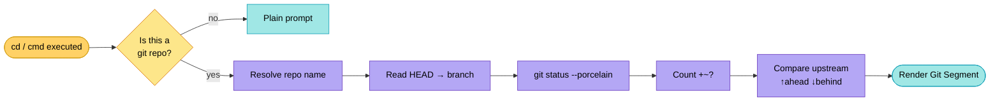
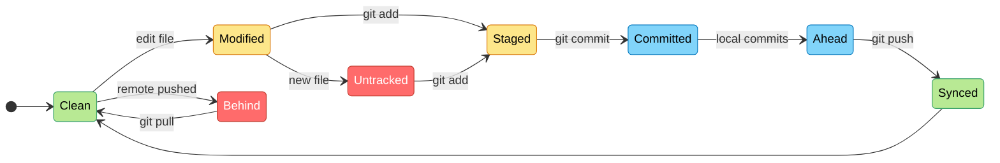

# 🐚 Intelligent Git Prompt

Munux includes a professional-grade Git integration that transforms your prompt into a real-time development dashboard. It provides immediate feedback on your repository state without requiring manual `git status` calls.

---

## 🚀 How it Works

The prompt automatically detects if you are inside a Git repository (or any sub-folder) and appends a **Git Segment** after your username.

**Format:** `(repo:branch +staged ~modified ?untracked ↑ahead ↓behind)`

---

## 🧭 Detection Pipeline

---

## 🚦 Repo State Machine

---

## 📊 Indicator Reference

Each symbol and color in the Git segment has a specific meaning designed for quick scanning.

| Symbol | Name | Color | Meaning |
|:---:|:---|:---|:---|
| `+` | **Staged** | Green | Files in the staging area (`git add`) |
| `~` | **Modified** | Yellow | Files changed in the worktree but not staged |
| `?` | **Untracked** | Red | New files not yet tracked by Git |
| `↑` | **Ahead** | Cyan | Commits existing locally but not on remote |
| `↓` | **Behind** | Red | New commits on remote that you need to pull |

---

## 🎨 Visual Examples

### 1. Clean Slate

`(Munux-Project:main)`
> You are on the `main` branch and everything is synchronized and saved.

### 2. Active Development

`(Munux-Project:feature/ui ~5 ?2)`
> You are on a feature branch with 5 modified files and 2 new (untracked) files.

### 3. Ready to Push

`(Munux-Project:main ↑3)`
> You have made 3 commits locally and are ready to run `git push`.

### 4. Need to Pull

`(Munux-Project:main ↓1)`
> Someone else pushed a change to the remote. Time to `git pull`!

---

## 🌟 Pro Tips

### Visibility

The prompt uses high-contrast **Light** variants of Blue and Magenta for the repo name and branch, ensuring readability regardless of your terminal transparency or background color.

### Real-Time Updates

The prompt is **reactive**. It refreshes every time you:

- Change directories (`cd`)
- Execute a command (`git add`, `git commit`, etc.)
- Modify files in the background

---

## 🎮 Gamification Impact

Using Git commands in Munux contributes to your progression:

- **Base XP**: Every successful `git` command grants **25 XP**.
- **Special Achievements**:
  - 🌿 **Version Control Initiate**: First `git` command.
  - 🔄 **GitHub integration**: Keeping your repo synced.

---

## Next Steps

- Learn more about [Gamification System](gamification-system.md)
- Back to [Quick Start Guide](quick-start.md)
