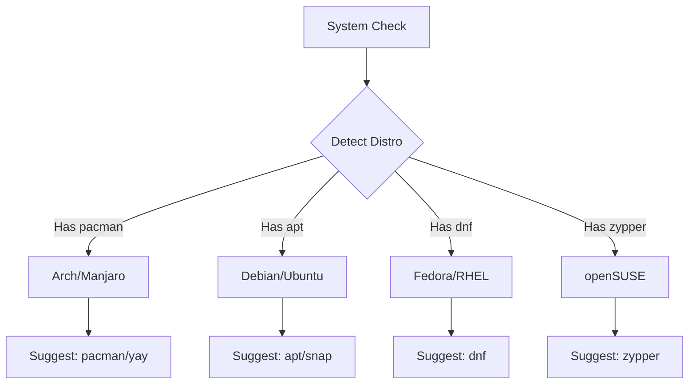

# 📦 Package Managers Guide

Munux natively recognizes and gamifies the use of package managers. Using them correctly rewards high XP.

 

> [!IMPORTANT]
> **Cross-Distro Support:** Munux detects which distro you are running and adjusts suggestions accordingly.

---

## Arch Linux / Manjaro

### 🏔️ Pacman & AUR

| Action | Command | Munux Reward |
|:-------|:--------|:------------:|
| **Install** | `sudo pacman -S firefox` | `50 XP` |
| **Remove** | `sudo pacman -Rns firefox` | `50 XP` |
| **Update** | `sudo pacman -Syu` | `75 XP` |
| **Search** | `pacman -Ss keyword` | `20 XP` |
| **Clean Cache** | `sudo pacman -Sc` | `30 XP` |
| **List Installed** | `pacman -Q` | `10 XP` |

#### AUR Helpers (Yay / Paru)

```bash
# Install from AUR
yay -S visual-studio-code-bin

# Update AUR packages
yay -Syu

# Search AUR
yay -Ss package-name
```

> [!TIP]
> Munux also supports **Yay** and **Paru**. First use unlocks the **"AUR Explorer"** achievement!

#### Common Patterns

```bash
# Full system upgrade (recommended weekly)
sudo pacman -Syu

# Install multiple packages
sudo pacman -S git vim tmux

# Remove package + dependencies
sudo pacman -Rns package-name

# View package info
pacman -Si firefox
```

---

## Debian / Ubuntu

### 📦 APT & Snap

| Action | Command | Munux Reward |
|:-------|:--------|:------------:|
| **Install** | `sudo apt install git` | `50 XP` |
| **Remove** | `sudo apt purge git` | `50 XP` |
| **Update Index** | `sudo apt update` | `25 XP` |
| **Upgrade Packages** | `sudo apt upgrade` | `50 XP` |
| **Full Upgrade** | `sudo apt update && sudo apt upgrade` | `75 XP` |
| **Search** | `apt search keyword` | `20 XP` |
| **Auto Remove** | `sudo apt autoremove` | `30 XP` |

#### Snap Packages

```bash
# Install snap package
sudo snap install code --classic

# List installed snaps
snap list

# Update snaps
sudo snap refresh
```

#### Common Patterns

```bash
# Typical workflow
sudo apt update
sudo apt upgrade -y
sudo apt autoremove

# Install with auto-yes
sudo apt install -y nodejs npm

# View package details
apt show firefox
```

> [!NOTE]
> Using `apt update && apt upgrade` in one command grants bonus XP for efficiency!

---

## Fedora / RHEL

### 🎩 DNF

| Action | Command | Munux Reward |
|:-------|:--------|:------------:|
| **Install** | `sudo dnf install htop` | `50 XP` |
| **Remove** | `sudo dnf remove htop` | `50 XP` |
| **Update** | `sudo dnf upgrade` | `75 XP` |
| **Search** | `dnf search keyword` | `20 XP` |
| **History** | `dnf history` | `30 XP` |
| **Clean Cache** | `sudo dnf clean all` | `30 XP` |

#### Common Patterns

```bash
# Full system update
sudo dnf upgrade --refresh

# Install group
sudo dnf group install "Development Tools"

# Rollback last transaction
sudo dnf history undo last

# Enable repository
sudo dnf config-manager --set-enabled repo-name
```

> [!TIP]
> Using `dnf history` to rollback changes unlocks the **"Time Traveler"** achievement!

---

## openSUSE

### 🦎 Zypper

| Action | Command | Munux Reward |
|:-------|:--------|:------------:|
| **Install** | `sudo zypper install vim` | `50 XP` |
| **Remove** | `sudo zypper remove vim` | `50 XP` |
| **Update** | `sudo zypper update` | `75 XP` |
| **Search** | `zypper search keyword` | `20 XP` |
| **Refresh Repos** | `sudo zypper refresh` | `25 XP` |

#### Common Patterns

```bash
# Full system upgrade
sudo zypper refresh && sudo zypper update

# Install pattern (software bundle)
sudo zypper install -t pattern devel_basis

# List repositories
zypper repos
```

---

## Universal: Flatpak

### 📦 Cross-Distribution Package Manager

| Action | Command | Munux Reward |
|:-------|:--------|:------------:|
| **Install** | `flatpak install flathub org.gimp.GIMP` | `50 XP` |
| **Run** | `flatpak run org.gimp.GIMP` | `10 XP` |
| **Update** | `flatpak update` | `30 XP` |
| **List Installed** | `flatpak list` | `10 XP` |

```bash
# Add Flathub repository (one-time setup)
flatpak remote-add --if-not-exists flathub https://flathub.org/repo/flathub.flatpakrepo

# Search for apps
flatpak search gimp

# Uninstall
flatpak uninstall org.gimp.GIMP
```

> [!NOTE]
> First Flatpak usage unlocks the **"Universal Explorer"** achievement!

---

## 🛡️ Best Practices & Safety

Munux encourages safe package management habits.

### ✅ DO:

| Practice | Why | XP Bonus |
|:---------|:----|:--------:|
| **Read package lists before confirming** | Avoid unwanted installations | +10 XP |
| **Update regularly** | Security patches | +25 XP |
| **Clean package cache** | Save disk space | +20 XP |
| **Use official repositories first** | Stability | - |
| **Check dependencies** | Avoid bloat | +15 XP |

### ❌ DON'T:

| Anti-Pattern | Problem | Penalty |
|:-------------|:--------|:-------:|
| **Partial upgrades** | `pacman -Sy` without `u` | Breaks streak |
| **Force install over conflicts** | Can break system | -50 XP |
| **Skip dependency checks** | Broken packages | -25 XP |
| **Mix package managers** | Conflicts and duplicates | Warning |

> [!WARNING]
> **Arch Users:** Never use `pacman -Sy package`. Always use full `pacman -Syu` to avoid partial upgrades.

---

## 🎯 Achievements Related to Package Management

| Achievement | Trigger | Reward |
|:------------|:--------|:------:|
| 🏔️ **Arch User** | First `pacman` command | 50 XP |
| 📦 **Debian Disciple** | First `apt` command | 50 XP |
| 🎩 **Fedora Faithful** | First `dnf` command | 50 XP |
| 🦎 **OpenSUSE Fan** | First `zypper` command | 50 XP |
| 📦 **Flatpak Explorer** | First `flatpak` command | 50 XP |
| 🌍 **Distro Hopper** | Use 3+ different package managers | 100 XP |
| 🧹 **Clean Freak** | Clean cache 10 times | 75 XP |
| 📚 **Package Scholar** | Search for packages 25 times | 50 XP |

---

## 📊 XP Multipliers

Certain patterns grant XP multipliers:

| Pattern | Multiplier | Example |
|:--------|:----------:|:--------|
| **Chained Update** | `1.5x` | `sudo apt update && sudo apt upgrade` |
| **Batch Install** | `1.3x` | `sudo pacman -S vim git tmux htop` |
| **Safe Removal** | `1.2x` | `sudo pacman -Rns` (removes deps) |

---

## 🔍 Distro Detection

Munux automatically detects your distribution and suggests the appropriate package manager.



When you type an unknown command, Munux will suggest:
- ✅ The correct package manager for your distro
- ✅ How to search for the package
- ✅ Installation command

---

## 🚀 Advanced Tips

### Arch: Downgrade Packages

```bash
# View package history
pacman -Q package-name

# Downgrade using cache
sudo pacman -U /var/cache/pacman/pkg/package-old-version.pkg.tar.zst
```

### Ubuntu: PPA Management

```bash
# Add PPA
sudo add-apt-repository ppa:user/ppa-name

# Remove PPA
sudo add-apt-repository --remove ppa:user/ppa-name
```

### Fedora: Enable RPM Fusion

```bash
sudo dnf install https://download1.rpmfusion.org/free/fedora/rpmfusion-free-release-$(rpm -E %fedora).noarch.rpm
```

---

## 📚 Related Documentation

- 🎮 [Gamification System](gamification-system.md) - Understand XP and levels
- ⚡ [Quick Start](quick-start.md) - First steps with Munux
- 🔧 [Troubleshooting](troubleshooting.md) - Solve package manager issues

> [!TIP]
> Type `help <distro>` inside Munux for context-sensitive package manager help!

```bash
help arch     # Manjaro/Arch guide
help debian   # Ubuntu/Debian guide
help fedora   # Fedora/RHEL guide
help suse     # openSUSE guide
help flatpak  # Universal packages
```

**Happy package hunting!** 📦🚀
