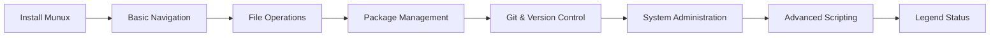

# ⚡ Quick Start Guide

Get up and running with Munux Reactive Workspace in under 5 minutes.

  

---

## 1. Installation

> [!TIP]
> **Recommended:** Install via Source to get the latest features.

### Option A: From Source (Recommended)

```bash
# 1. Clone the repo
git clone https://github.com/Munique-Feitoza/Munux-Reactive-Workspace.git

# 2. Enter directory
cd Munux-Reactive-Workspace

# 3. Blast off! 🚀
cargo run --release
```

### Option B: Using Helper Scripts

```bash
# Automated setup (installs dependencies)
./setup.sh

# Quick run
./run.sh
```

> [!NOTE]
> If you don't have Rust installed, visit [rustup.rs](https://rustup.rs/) first.

---

## 2. Your First Launch

When you open Munux, you will see the **Split-Screen Interface**:

```
┌───────────────────────────────┬──────────────────────────────┐
│ TERMINAL (You type here)      │ REACTIVE CONTEXT (Watch this)│
│                               │                              │
│ ➜ [Beginner@munux]$ _         │        🐧 HELLO!             │
│                               │                              │
│                               │   Welcome to Munux.          │
│                               │   Type 'help' to start.      │
│                               │                              │
└───────────────────────────────┴──────────────────────────────┘
   [ Lvl 1 ] XP: [░░░░░░]  INTEGRITY: 100%
```

### 🐣 Try These Commands Immediately

**1. Check your stats:**

```bash
stats
```

Watch the right panel change to show your profile, XP, and achievements.

**2. Navigate safely:**

```bash
ls -la
```

Watch the right panel show a **file tree** of your current directory.

**3. Trigger the Danger Zone (Safe Simulation):**

Type this (**but don't press enter yet**):

```bash
rm -rf
```

> [!WARNING]
> Notice how the interface turns **RED** to warn you? That's the Reactive Engine protecting you!

Press **ESC** to cancel without executing.

---

## 3. Keyboard Shortcuts

| Shortcut | Action |
|:---------|:-------|
| `Enter` | Execute command |
| `Ctrl + L` | Clear screen |
| `Ctrl + C` | Exit Munux safely |
| `ESC` | Close popups / Cancel dangerous input |
| `Up / Down` | Navigate command history |
| `Q` | Open quest panel |
| `S` | Open stats panel |

---

## 4. First Achievements

Now that you are running, try to unlock your first achievement:

### 🎯 Quest Checklist

- [ ] **Quest:** Execute 10 commands without errors
- [ ] **Quest:** Use your distro's package manager (`apt`, `pacman`, etc.)
- [ ] **Quest:** Find an Easter Egg (Hint: Try `sl` or `fortune`)
- [ ] **Achievement:** Reach level 5 to unlock the **Terminal** theme

### 🏆 Quick XP Guide

| Action | XP Reward |
|:-------|:---------:|
| Navigate with `cd` | 5 XP |
| List files with `ls` | 5 XP |
| Create file with `touch` | 10 XP |
| Install package with `pacman`/`apt` | 50 XP |
| Use Git command | 25 XP |

> [!TIP]
> Type `xp` at any time to see your current XP and progress to the next level.

---

## 5. Understanding the Interface

### Left Panel (60%) - Terminal

This is your **fully functional terminal**. ALL Linux commands work here:

```bash
# Package management
sudo pacman -Syu

# File operations
mkdir project && cd project

# Git
git clone https://github.com/...

# System monitoring
htop

# Text editing
nano file.txt
```

### Right Panel (40%) - Reactive Context

This panel **automatically changes** based on what you type:

| You Type | Panel Shows |
|:---------|:------------|
| `ls` | 📁 File tree |
| `cat file.txt` | 📄 File preview with syntax highlighting |
| `top` or `htop` | 📊 Real-time CPU/RAM graphs |
| `rm -rf` | 🚨 **DANGER ZONE** warning |
| `help` | 📚 Documentation |
| `stats` | 📈 Your statistics and progress |
| Easter egg command | 🥚 Special ASCII art |

### Bottom HUD - Status Bar

Shows at a glance:
- **Level** - Current tier (Beginner, Terminal, Hacker, etc.)
- **XP Bar** - Progress to next level
- **Achievements** - Total unlocked badges
- **Streak** - Consecutive successful commands
- **Integrity** - System health (100% = no errors)

---

## 6. Learning Path

Follow this progression to master Munux:



### Week 1: Fundamentals

```bash
# Navigation
pwd
ls -lah
cd /home
cd ..

# File operations
touch test.txt
mkdir projects
cp test.txt projects/
rm test.txt
```

### Week 2: Package Management

```bash
# Arch/Manjaro
sudo pacman -Syu
yay -S firefox

# Ubuntu/Debian
sudo apt update
sudo apt install git

# Fedora
sudo dnf install htop
```

### Week 3: Git Mastery

```bash
git init
git add .
git commit -m "Initial commit"
git push origin main
```

### Week 4: System Power

```bash
systemctl status
journalctl -f
sudo chmod +x script.sh
ps aux | grep firefox
```

---

## 7. Common First-Time Issues

### Problem: "I see boxes `[]` instead of icons"

**Solution:** Install a Nerd Font.

```bash
# Download JetBrains Mono Nerd Font
# Set it as your terminal font
# Restart Munux
```

See [Fonts Guide](fonts.md) for detailed instructions.

### Problem: "Compilation fails with 'linker cc not found'"

**Solution:** Install build tools.

```bash
# Ubuntu/Debian
sudo apt install build-essential

# Arch/Manjaro
sudo pacman -S base-devel

# Fedora
sudo dnf groupinstall "Development Tools"
```

### Problem: "The terminal feels slow"

**Solution:** Always use **release mode**.

```bash
# Never use this for actual usage:
cargo run

# Always use this:
cargo run --release
```

> [!NOTE]
> Release mode is typically **10x to 50x faster** than debug mode.

---

## 8. Next Steps

🎉 **Congratulations!** You are now ready to use Munux.

**Continue your journey:**

- 📚 Read [Gamification System](gamification-system.md) to understand XP and achievements
- 📦 Check [Package Managers Guide](package-managers.md) for distro-specific commands
- 🔧 Visit [Troubleshooting](troubleshooting.md) if you encounter issues
- 🏗️ Explore [Architecture](../architecture/overview.md) to understand how it works

> [!TIP]
> Need help? Type `help` inside Munux or join our community discussions!

---

## Quick Reference Card

Print this for your desk:

```
┌─────────────────────────────────────────────────────────────┐
│                    MUNUX QUICK REFERENCE                    │
├─────────────────────────────────────────────────────────────┤
│ COMMANDS                                                    │
│   stats          View your profile and achievements         │
│   quests         See active missions                        │
│   help           Show help menu                             │
│   xp             Check current XP                           │
│                                                             │
│ SHORTCUTS                                                   │
│   Enter          Execute command                            │
│   ESC            Cancel / Close popup                       │
│   Ctrl+C         Exit Munux                                 │
│   Ctrl+L         Clear screen                               │
│   Q              Quest panel                                │
│   S              Stats panel                                │
│                                                             │
│ XP REWARDS                                                  │
│   Navigation     5 XP     Package Mgmt   50 XP             │
│   File Ops       10 XP    Admin Tasks    40 XP             │
│   Git            25 XP    Network        30 XP             │
└─────────────────────────────────────────────────────────────┘
```

**Happy terminal adventures!** 🚀🐧
