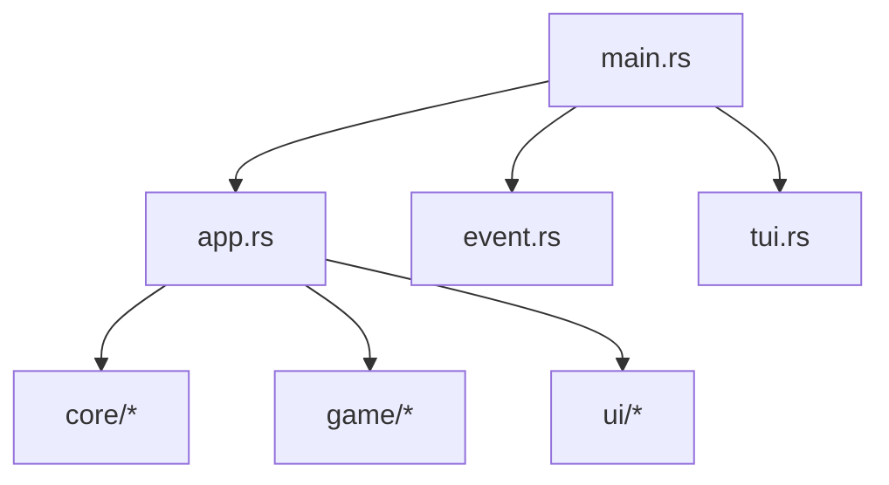

# 🔬 Referência da API - Módulos Core

Documentação completa da API para os componentes principais do Munux Reactive Workspace.

  

> [!NOTE]
> Este documento descreve a API interna para a versão v0.1.0. Para padrões de arquitetura, veja a [Visão Geral da Arquitetura](../architecture/overview.md).

---

## Organização de Módulos



---

## Ponto de Entrada

### `main.rs`

Ponto de entrada da aplicação e loop de eventos.

**Responsabilidades:**

- Inicialização e restauração do terminal
- Gerenciamento do loop de eventos
- Renderização de frames (60 FPS)

---

## Estado da Aplicação

### `app.rs` - Struct `App`

Estado central da aplicação seguindo a **The Elm Architecture (TEA)**.

#### Métodos Principais

| Método | Assinatura | Propósito |
|:-------|:----------|:--------|
| `new()` | `fn new() -> Self` | Inicializa com valores padrão |
| `handle_key()` | `fn handle_key(&mut self, key: KeyEvent) -> Result<()>` | Processa entrada do teclado |
| `execute_command()` | `fn execute_command(&mut self, cmd: &str) -> Result<()>` | Executa comando shell |

---

## Módulos Core (`src/core/`)

### `parser.rs` - Classificação de Comandos

Analisa comandos e os categoriza usando padrões regex.

```rust
pub enum CommandType {
    Navigation,      // cd, ls, pwd
    FileOps,        // touch, mkdir, cp, mv, rm
    TextProcessing, // cat, grep, sed, awk
    System,         // ps, top, htop, kill
    PackageManager, // pacman, apt, dnf, yay
    Network,        // ping, curl, wget, ssh
    Git,           // comandos git
    Dangerous,     // rm -rf, dd, chmod 000
    Help,          // help, man
    Unknown,       // Não reconhecido
}
```

#### API do Parser

- `classify(cmd: &str) -> CommandType`: Classifica uma string de comando.
- `calculate_xp(cmd_type: &CommandType) -> u32`: Calcula a recompensa de XP.
- `is_dangerous(cmd: &str) -> bool`: Verifica se o comando é perigoso.

---

### `shell.rs` - Execução de Comandos

Executa comandos via shell do sistema e captura a saída.

> [!WARNING]
> Todos os comandos rodam via `sh -c`. Garanta o escape correto de strings na entrada do usuário!

---

### `filesystem.rs` - Operações de Arquivo

Navegação e leitura segura do sistema de arquivos.

**Garantias de Segurança:**

- ✅ Valida caminhos antes do acesso
- ✅ Respeita permissões do Linux
- ✅ Limita o tamanho de leitura (previne OOM em arquivos gigantes)
- ✅ Sem código `unsafe` (segurança Rust total)

---

## Módulos de Jogo (`src/game/`)

### `state.rs` - Estado do Jogo

Rastreamento de progressão persistente.

- **Level**: Nível atual do jogador.
- **XP**: Pontos de experiência acumulados.
- **Streak**: Sequência de comandos bem-sucedidos.
- **Achievements/Quests**: Listas de conquistas e missões ativas.

---

## Módulos de Interface (`src/ui/`)

### `theme.rs` - Sistema de Temas

Temas progressivos baseados no nível do jogador.

- 🌱 **Iniciante** (Ciano)
- 💻 **Terminal** (Matrix Green)
- 🔓 **Hacker** (Cyber Pulse)
- 🌃 **Cyberpunk** (Night City)
- 👑 **Elite** (Roxo)
- ⭐ **Legend** (RGB/Rainbow)

---

## Próximos Passos

- 🏗️ [Visão Geral da Arquitetura](../architecture/overview.md)
- 🧪 [Guia de Testes](../TESTING.md)
- 🤝 [Contribuição](../contributing/code-of-conduct.md)
