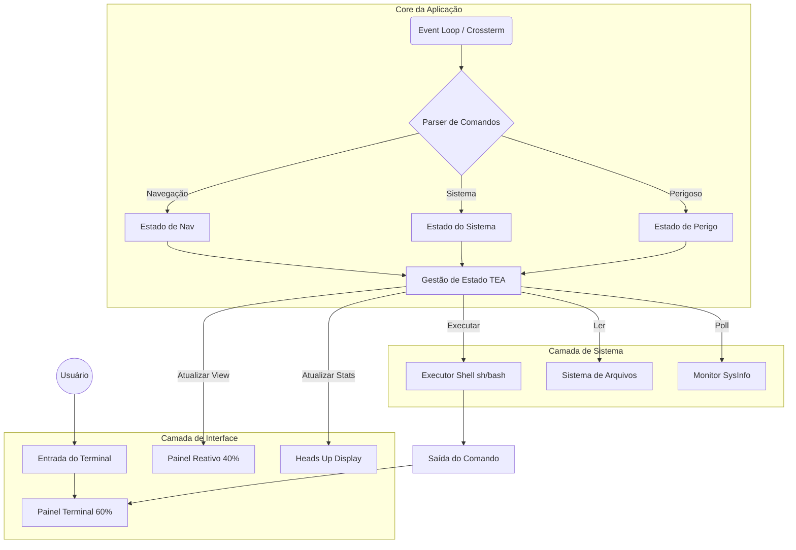

# 🏗️ Visão Geral da Arquitetura

> [!NOTE]
> Este documento descreve o design de alto nível do Munux v0.1.0. Para detalhes de implementação, veja a referência da API em [core-modules.md](../api/core-modules.md).

## Resumo Executivo

O Munux implementa uma **arquitetura de painéis divididos reativos** baseada na **The Elm Architecture (TEA)**. Ele combina o poder bruto de um shell Unix com uma camada de interface inteligente e consciente de estado que fornece contexto em tempo real e gamificação.

---

## Arquitetura de Alto Nível



---

## Padrões de Design

### 1. The Elm Architecture (TEA)

O Munux garante uma gestão de estado previsível através de um fluxo de dados unidirecional.

```rust
// Model - Fonte única da verdade
struct App { 
    state: State 
}

// Update - Transformações de estado puras
fn update(msg: Msg, model: &mut App) -> Command

// View - Renderização imutável
fn view(model: &App) -> Frame
```

> [!TIP]
> **Por que TEA?** Este padrão torna a aplicação incrivelmente fácil de debugar. Como a visualização é uma função pura do estado, podemos reproduzir qualquer bug visual apenas conhecendo os dados do estado.

---

### 2. Strategy Pattern (Classificação de Comandos)

Categorizamos a entrada do usuário em 11 estratégias distintas para determinar a reação da UI.

| Estratégia | Gatilho | Reação da UI |
|----------|---------|-------------|
| **Navegação** | `cd`, `ls`, `pwd` | Visualização de Árvore de Arquivos |
| **Arquivos** | `touch`, `mkdir`, `cp` | Painel de visualização de arquivos |
| **Monitoramento** | `top`, `ps`, `htop` | Gráficos (CPU/RAM) em tempo real |
| **Gerenciamento** | `pacman`, `apt`, `dnf` | Progresso de instalação |
| **Rede** | `ping`, `curl`, `wget` | Status da rede |
| **Perigoso** | `rm -rf`, `dd`, `sudo` | 🚨 Painel de Aviso Vermelho |
| **Git** | comandos `git` | Status do repositório |
| **Ajuda** | `help`, `man` | Visualizador de documentação |

Cada estratégia determina: **recompensa de XP**, **modo do painel reativo** e **gatilhos de conquistas**.

---

## Fluxo de Dados

1. 🎹 Usuário digita comando
2. 🔄 Event loop captura entrada (Crossterm)
3. 🔍 Parser classifica o tipo do comando
4. 💾 Estado é atualizado (XP, conquistas, missões)
5. 🐚 Comando executado via shell (`sh -c`)
6. 📋 Saída capturada (stdout/stderr)
7. 🎨 UI re-renderizada com base no novo estado
8. 🖥️ Display atualizado (60Hz refresh)

---

## Próximos Passos

- 📖 Leia a [Referência da API](../api/core-modules.md)
- 🔧 Confira o [Processo de Build](../../README.md#instalação)
- 🎮 Explore as [Mecânicas de Gamificação](../guides/gamification-system.md)
