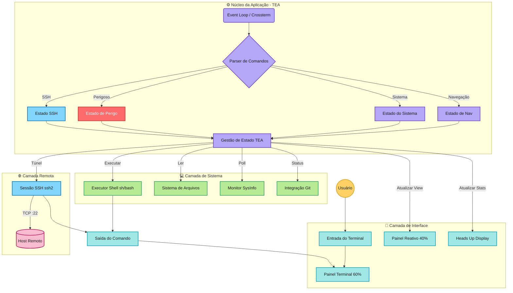
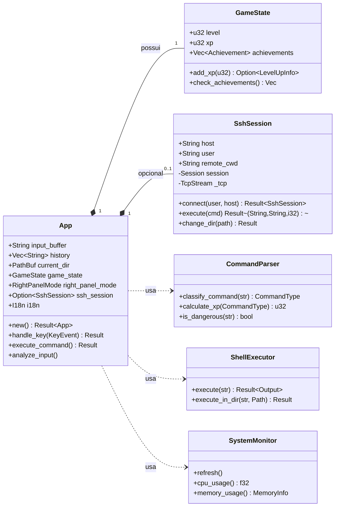
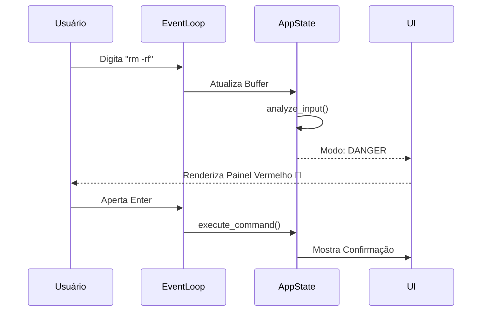
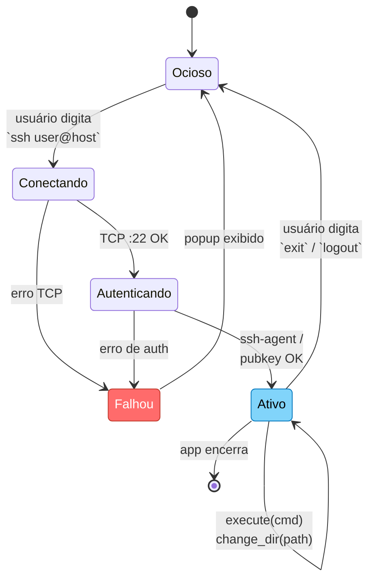
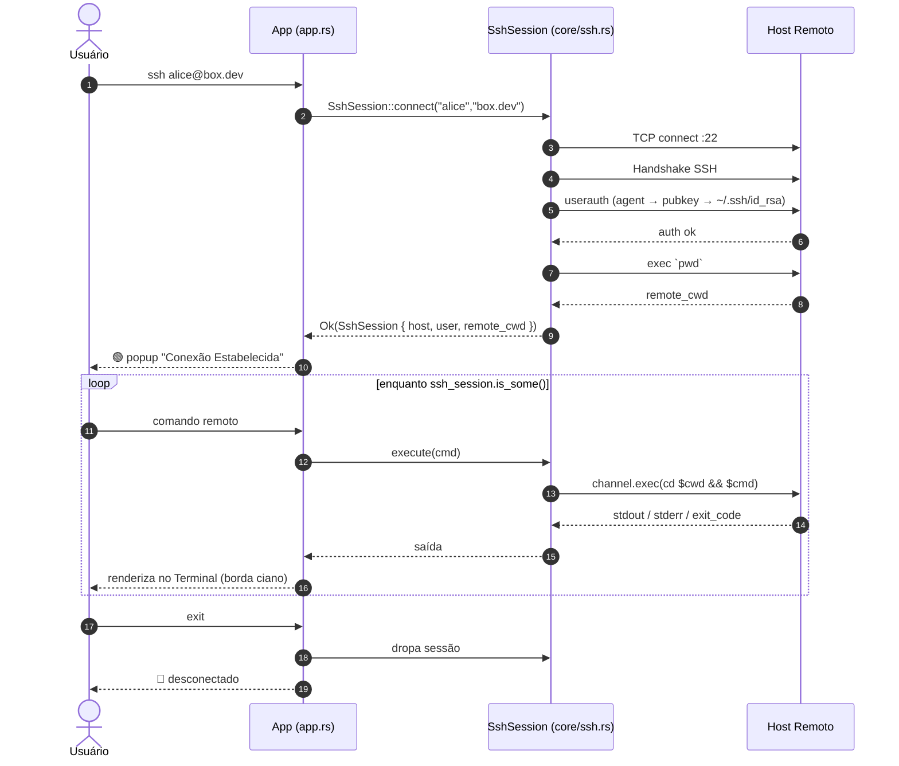
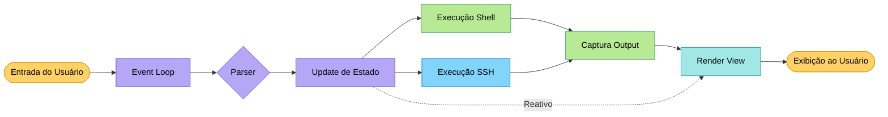
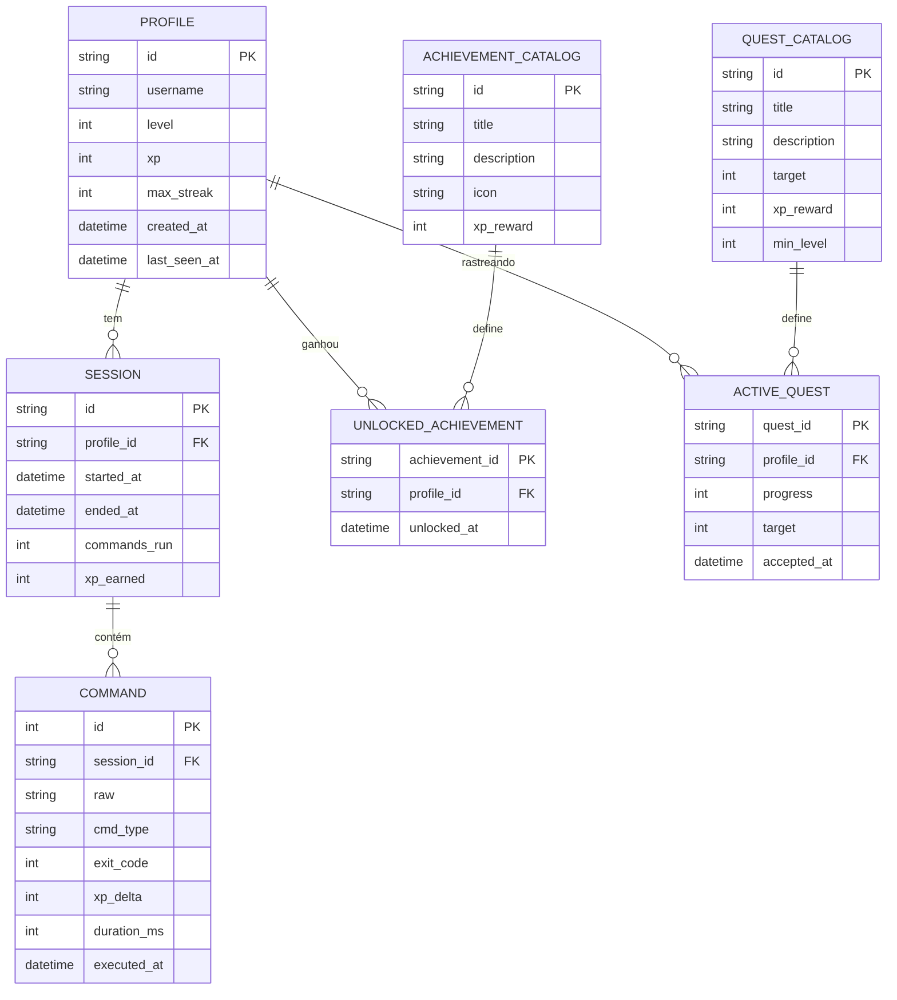

# 🏗️ Visão Geral da Arquitetura

> [!NOTE]
> Este documento descreve o design de alto nível do Munux. Para detalhes de implementação, veja a referência da API em [core-modules.md](../api/core-modules.md).

## Resumo Executivo

O Munux implementa uma **arquitetura de painéis divididos reativos** baseada na **The Elm Architecture (TEA)**. Ele combina o poder bruto de um shell Unix com uma camada de interface inteligente e consciente de estado que fornece contexto em tempo real e gamificação.

---

## Arquitetura de Alto Nível



> [!TIP]
> 🟨 Usuário · 🟦 UI · 🟪 Core · 🟩 Sistema · 🟦 SSH · 🟥 Perigo — cores para leitura rápida.

---

## Diagrama de Classes do Core (UML)



---

## Padrões de Design

### 1. The Elm Architecture (TEA)

O Munux garante uma gestão de estado previsível através de um fluxo de dados unidirecional.

```rust
// Model - Fonte única da verdade
struct App {
    state: State
}

// Update - Transformações de estado puras
fn update(msg: Msg, model: &mut App) -> Command

// View - Renderização imutável
fn view(model: &App) -> Frame
```

> [!TIP]
> **Por que TEA?** Este padrão torna a aplicação incrivelmente fácil de debugar. Como a view é uma função pura do estado, podemos reproduzir qualquer bug visual apenas conhecendo os dados do estado.

---

### 2. Strategy Pattern (Classificação de Comandos)

Categorizamos a entrada do usuário em 11 estratégias distintas para determinar a reação da UI.

| Estratégia | Gatilho | Reação da UI |
|----------|---------|-------------|
| **Navegação** | `cd`, `ls`, `pwd` | Visualização de árvore de arquivos |
| **Arquivos** | `touch`, `mkdir`, `cp` | Painel de preview |
| **Monitoramento** | `top`, `ps`, `htop` | Gráficos em tempo real (CPU/RAM) |
| **Pacotes** | `pacman`, `apt`, `dnf` | Progresso de instalação |
| **Rede** | `ping`, `curl`, `wget` | Status de rede |
| **Perigoso** | `rm -rf`, `dd`, `sudo` | 🚨 Painel vermelho de aviso |
| **Git** | comandos `git` | Status do repositório |
| **Texto** | `cat`, `grep`, `sed` | Preview de conteúdo |
| **Ajuda** | `help`, `man` | Visualizador de docs |
| **Easter Eggs** | `sl`, `cowsay`, `fortune` | Animações especiais |
| **Desconhecido** | Não reconhecido | Sistema de sugestões |

Cada estratégia determina: **recompensa de XP**, **modo do painel reativo** e **gatilhos de conquistas**.

---

### 3. Observer Pattern (Painéis Reativos)

O painel da direita "observa" o buffer de input. Conforme você digita (antes de pressionar Enter), a UI reage.



---

## Componentes

| Componente | Arquivo | Responsabilidade |
|-----------|------|----------------|
| **Event Loop** | `event.rs` | Input de teclado (Crossterm), resize, polling 60Hz |
| **App State** | `app.rs` | Estado do jogo (XP, nível, conquistas), histórico |
| **Parser** | `core/parser.rs` | Classificação de comandos, cálculo de XP, detecção de perigo |
| **Shell Executor** | `core/shell.rs` | Executa via `sh -c`, captura stdout/stderr |
| **File System** | `core/filesystem.rs` | Listagem, preview, navegação |
| **Monitor** | `core/monitor.rs` | Métricas CPU/RAM/Swap em tempo real (SysInfo) |
| **SSH Session** | `core/ssh.rs` | Shell remoto via `ssh2` (auth por agente / chave), tracking de cwd remoto |
| **Git Integration** | `core/git.rs` | Detecção de branch/status |
| **Terminal Panel** | `ui/terminal.rs` | Painel esquerdo — saída de comandos |
| **Reactive Panel** | `ui/reactive.rs` | Painel direito — modos sensíveis ao contexto |
| **HUD** | `ui/hud.rs` | Barra inferior — XP, nível, streak, integridade |
| **Theme System** | `ui/theme.rs` | Temas progressivos (6 níveis) |
| **I18n** | `i18n.rs` | Localização em runtime (EN/PT-BR) via Fluent |

---

## Ciclo de Vida da Sessão SSH (Diagrama de Estados)



### Fluxo de Comando SSH (Sequência)



---

## Fluxo de Dados



**Passo a passo:**
1. 🎹 Usuário digita comando
2. 🔄 Event loop captura entrada (Crossterm)
3. 🔍 Parser classifica o tipo do comando
4. 💾 Estado atualizado (XP, conquistas, missões)
5. 🐚 Comando executado via shell local (`sh -c`) **ou** via canal SSH remoto
6. 📋 Saída capturada (stdout/stderr)
7. 🎨 UI re-renderizada com base no novo estado
8. 🖥️ Display atualizado (60Hz refresh)

---

## Modelo de Segurança

> [!WARNING]
> **Segurança em primeiro lugar**: Munux cria uma camada de proteção, mas os comandos são executados de fato no host.

| Camada | Proteção |
|-------|-----------|
| **Detecção de Comandos Perigosos** | Pattern matching intercepta `rm`, `dd`, `chmod` antes da execução |
| **Isolamento Shell** | Comandos rodam em instâncias isoladas de `sh -c` |
| **Permissões** | Munux respeita as permissões padrão de User/Group do Linux |
| **Sem Escalada de Privilégios** | Nunca tenta ganhar root automaticamente |
| **Confirmação Explícita** | Painel vermelho + confirmação explícita para operações destrutivas |
| **SSH: só chave/agente** | Sem suporte a senha interativa — evita armazenamento em memória |

---

## Performance

| Métrica | Valor | Notas |
|--------|-------|-------|
| **Taxa de atualização** | 60 Hz | Frequência de polling do event loop |
| **Uso de memória** | ~10-20 MB | Footprint típico |
| **CPU (ocioso)** | <1% | Processamento em background mínimo |
| **Tempo de startup** | <200ms | Build release, cold start |

> [!TIP]
> Sempre use `cargo run --release` em uso real. Builds debug são 10-50x mais lentas.

---

## Melhorias Futuras

### 🌐 Rede
- [x] ✅ **Integração SSH** com view reativa (via `ssh2`, v0.1.1+)
- [ ] Auth interativa por senha (hoje só agente + pubkey)
- [ ] Monitoramento remoto via túneis SSH

### 🗂️ Persistência
- [ ] Salvar XP e conquistas em `~/.munux/state.json`
- [ ] Histórico entre sessões (SQLite)

#### Modelo de Dados Proposto (ER)

> [!NOTE]
> Ainda não implementado. Rascunho para a futura separação `~/.munux/state.json` (JSON) + `~/.munux/history.db` (SQLite).



**Estratégia de armazenamento:**
- 🟨 `state.json` → `PROFILE`, `UNLOCKED_ACHIEVEMENT`, `ACTIVE_QUEST` (pequeno, legível, escrita atômica).
- 🟦 `history.db` (SQLite) → `SESSION`, `COMMAND` (muitos inserts, indexado por `executed_at`).
- 🟩 Catálogos (`ACHIEVEMENT_CATALOG`, `QUEST_CATALOG`) são compilados no binário, não persistidos.

### 🔌 Sistema de Plugins
- [ ] Handlers customizados via WASM
- [ ] Conquistas definidas pelo usuário (Lua)

---

## Próximos Passos

- 📖 Leia a [Referência da API](../api/core-modules.md)
- 🔧 Confira o [Processo de Build](../../README.md#instalação)
- 🎮 Explore as [Mecânicas de Gamificação](../guides/gamification-system.md)
