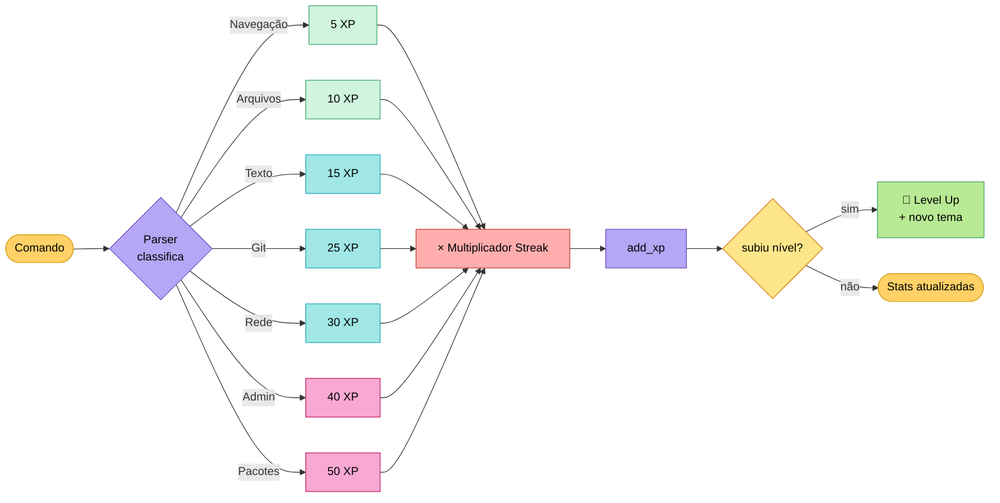
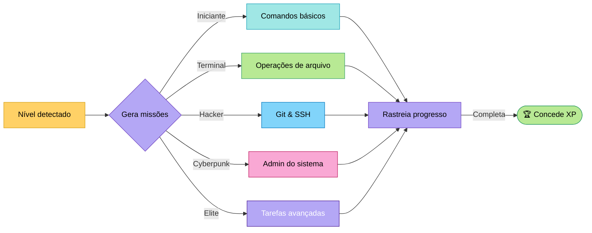

# 🎮 Sistema de Gamificação

> [!IMPORTANT]
> A gamificação no Munux foi projetada para reforçar o aprendizado, não para distrair dele. Todas as mecânicas incentivam o uso correto do terminal e a exploração.

## Os 4 Pilares de Progressão

O Munux transforma o uso do terminal em uma experiência de RPG usando quatro mecânicas principais:

1. **Pontos de Experiência (XP)** - Ganhos ao executar comandos
2. **Níveis e Patentes** - Desbloqueiam customização visual e ferramentas
3. **Conquistas (Achievements)** - Medalhas por marcos específicos
4. **Streaks (Sequências)** - Multiplicadores por consistência

---

## 🏗️ Pontos de Experiência (XP)

O XP é calculado dinamicamente com base na complexidade da operação.

$$\text{Total de XP} = (\text{XP Base do Comando}) \times (\text{Multiplicador de Streak})$$

### Pipeline de XP (fluxo colorido)

### Tabela de Valores de XP

| Tipo de Comando | XP Base | Contexto |
|:-------------|:-------:|:--------|
| **Navegação** | `5 XP` | `cd`, `ls`, `pwd` |
| **Arquivos** | `10 XP` | `mkdir`, `touch`, `cp` |
| **Processamento de Texto** | `15 XP` | `grep`, `sed`, `awk` |
| **Git** | `25 XP` | `git commit`, `git push` |
| **Sincronização Git** | `10 XP` | Atualizar status ahead/behind |
| **Rede** | `30 XP` | `ping`, `curl`, `ssh` |
| **Administração** | `40 XP` | `systemctl`, `journalctl` |
| **Gerenciador de Pacotes** | `50 XP` | `pacman`, `apt`, `dnf` |
| **Comando Perigoso** | `25 XP` | Uso correto de `rm` ou `sudo` |

> [!NOTE]
> Comandos perigosos dão XP **apenas** se usados corretamente. Erros destrutivos penalizam sua sequência (streak)!

---

## 🏆 Progressão de Nível

| Nível | Patente | Identidade Visual | Desbloqueia |
|:-----:|:----------|:----------------|:--------|
| **1-9** | 🌱 **Iniciante** | Tema Ciano | Comandos Básicos |
| **10-19** | 💻 **Terminal** | Matrix Green | Manipulação de Arquivos |
| **20-29** | 🔓 **Hacker** | Hacker Cyan | Editores de Texto (`nano`/`vim`) |
| **30-39** | 🌃 **Cyberpunk** | Cyberpunk Magenta | Git e Redes |
| **40-49** | 👑 **Elite** | Elite Purple | Docker e Containers |
| **50+** | ⭐ **Lenda** | Rainbow/RGB | **Modo de Deus** |

### Máquina de Estados de Patente

```mermaid
stateDiagram-v2
    direction LR
    [*] --> Iniciante
    Iniciante --> Terminal : nível ≥ 10
    Terminal --> Hacker : nível ≥ 20
    Hacker --> Cyberpunk : nível ≥ 30
    Cyberpunk --> Elite : nível ≥ 40
    Elite --> Lenda : nível ≥ 50
    Lenda --> [*] : mestre 🏆

    classDef beg fill:#a0e7e5,stroke:#17a2b8,color:#000
    classDef term fill:#b8e994,stroke:#38a169,color:#000
    classDef hack fill:#81d4fa,stroke:#0277bd,color:#000
    classDef cyber fill:#f9a8d4,stroke:#be185d,color:#000
    classDef elite fill:#b4a7f5,stroke:#6f42c1,color:#000
    classDef leg fill:#ffd166,stroke:#d4a017,color:#000
    class Iniciante beg
    class Terminal term
    class Hacker hack
    class Cyberpunk cyber
    class Elite elite
    class Lenda leg
```

---

## 🏅 Conquistas (Achievements)

As conquistas fornecem grandes bônus de XP e medalhas únicas exibidas em seu perfil.

### Categoria: Gerenciadores de Pacotes

| Medalha | Título | Gatilho | Recompensa |
|:-----:|:------|:--------|:------:|
| 🏔️ | **Arch User** | Usar `pacman` | `50 XP` |
| 📦 | **Debian Disciple** | Usar `apt` | `50 XP` |
| 🎩 | **Fedora Faithful** | Usar `dnf` | `50 XP` |

### Categoria: Primeiros Passos

| Medalha | Título | Gatilho | Recompensa |
|:-----:|:------|:--------|:------:|
| 🎯 | **Primeiro Comando** | Executar qualquer comando | `10 XP` |
| 📁 | **Navegador** | Usar `cd` | `20 XP` |
| 👀 | **Observador** | Usar `ls` | `20 XP` |
| 🔐 | **Superusuário** | Primeiro comando `sudo` | `40 XP` |

---

## ⚔️ Sistema de Missões (Quests)

As missões são geradas processualmente com base no seu nível atual.

### Exemplos de Missões por Patente

| Patente | Exemplos de Missões |
|:-----|:--------------|
| 🌱 **Iniciante** | "Execute seu primeiro `ls`", "Crie um arquivo com `touch`" |
| 💻 **Terminal** | "Use `grep` para achar texto", "Instale um pacote" |
| 🔓 **Hacker** | "Configure seu Git", "Use SSH para conectar" |

> [!NOTE]
> Digite `quests` no terminal para ver seu progresso ativo.

---

## 🔥 Sistema de Streak (Sequência)

O Streak rastreia quantos comandos bem-sucedidos você executou em sequência (sem erros).

| Streak | Multiplicador | Efeito Visual |
|:------:|:----------:|:--------------|
| 0-4 | `1.0x` | Normal |
| 5-9 | `1.2x` | 🔥 Ícone de Fogo |
| 10-24 | `1.5x` | 🔥🔥 Fogo Duplo |
| 25+ | `2.0x` | 🔥🔥🔥 **GODLIKE** |

---

## Próximos Passos

- 🎯 Tente desbloquear sua primeira conquista!
- 🐚 Domine a [Integração Git](git-integration.md)
- 🔥 Construa um streak de 10+ comandos
- 📊 Use `stats` para ver seu progresso
