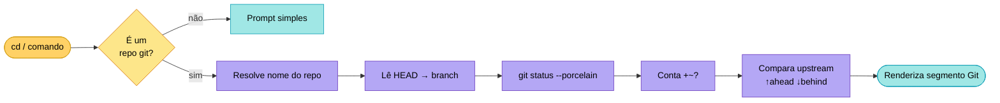
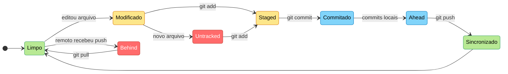

# 🐚 Integração Git Inteligente

O Munux inclui uma integração Git de nível profissional que transforma seu prompt em um painel de desenvolvimento em tempo real. Ele fornece feedback imediato sobre o estado do seu repositório sem exigir comandos manuais de `git status`.

---

## 🚀 Como Funciona

O prompt detecta automaticamente se você está dentro de um repositório Git (ou qualquer subpasta) e anexa um **Segmento Git** após o seu nome de usuário.

**Formato:** `(repo:branch +staged ~modified ?untracked ↑ahead ↓behind)`

---

## 🧭 Pipeline de Detecção

---

## 🚦 Máquina de Estados do Repo

---

## 📊 Referência de Indicadores

Cada símbolo e cor no segmento Git tem um significado específico projetado para leitura rápida.

| Símbolo | Nome | Cor | Significado |
|:---:|:---|:---|:---|
| `+` | **Staged** | Verde | Arquivos na área de preparação (`git add`) |
| `~` | **Modificado** | Amarelo | Arquivos alterados mas não adicionados (staged) |
| `?` | **Untracked** | Vermelho | Novos arquivos ainda não rastreados pelo Git |
| `↑` | **Ahead** | Ciano | Commits locais que ainda não estão no servidor |
| `↓` | **Behind** | Vermelho | Novos commits no servidor que você precisa puxar |

---

## 🎨 Exemplos Visuais

### 1. Tudo Limpo

`(Munux-Project:main)`
> Você está na branch `main` e tudo está sincronizado e salvo.

### 2. Desenvolvimento Ativo

`(Munux-Project:feature/ui ~5 ?2)`
> Você está em uma branch de funcionalidade com 5 arquivos modificados e 2 novos arquivos.

### 3. Pronto para o Push

`(Munux-Project:main ↑3)`
> Você fez 3 commits locais e está pronto para rodar `git push`.

### 4. Precisa de Pull

`(Munux-Project:main ↓1)`
> Alguém enviou mudanças para o servidor. Hora de dar `git pull`!

---

## 🌟 Dicas Pro

### Visibilidade

O prompt usa variantes **Light** de Azul e Magenta para o nome do repositório e da branch, garantindo leitura total independente da transparência ou cor de fundo do seu terminal.

### Atualizações em Tempo Real

O prompt é **reativo**. Ele atualiza sempre que você:

- Muda de diretório (`cd`)
- Executa um comando (`git add`, `git commit`, etc.)
- Modifica arquivos no background

---

## 🎮 Impacto na Gamificação

Usar comandos Git no Munux contribui para sua progressão:

- **XP Base**: Cada comando `git` bem-sucedido concede **25 XP**.
- **XP de Sincronia**: Manter o status atualizado concede bônus de **10 XP**.

---

## Próximos Passos

- Saiba mais sobre o [Sistema de Gamificação](gamification-system.md)
- Volte para o [Guia de Início Rápido](quick-start.md)
