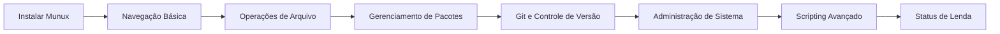

# ⚡ Guia de Início Rápido

Comece a usar o Munux Reactive Workspace em menos de 5 minutos.

  

---

## 1. Instalação

> [!TIP]
> **Recomendado:** Instale via código-fonte para obter as funcionalidades mais recentes.

### Opção A: Via Código-fonte (Recomendado)

```bash
# 1. Clone o repositório
git clone https://github.com/Munique-Feitoza/Munux-Reactive-Workspace.git

# 2. Entre no diretório
cd Munux-Reactive-Workspace

# 3. Decolar! 🚀
cargo run --release
```

### Opção B: Usando Scripts Auxiliares

```bash
# Setup automatizado (instala dependências)
./setup.sh

# Execução rápida
./run.sh
```

> [!NOTE]
> Se você não tem o Rust instalado, visite [rustup.rs](https://rustup.rs/) primeiro.

---

## 2. Sua Primeira Execução

Quando você abrir o Munux, verá a **Interface de Tela Dividida**:

```
┌───────────────────────────────┬──────────────────────────────┐
│ TERMINAL (Você digita aqui)   │ CONTEXTO REATIVO (Observe)   │
│                               │                              │
│ ➜ [Beginner@munux]$ _         │        🐧 OLÁ!               │
│                               │                              │
│                               │   Bem-vindo ao Munux.        │
│                               │   Digite 'help' para começar.│
│                               │                              │
└───────────────────────────────┴──────────────────────────────┘
   [ Nív 1 ] XP: [░░░░░░]  INTEGRIDADE: 100%
```

### 🐣 Experimente estes comandos imediatamente

**1. Verifique seus status:**

```bash
stats
```

Observe o painel direito mudar para mostrar seu perfil, XP e conquistas.

**2. Navegue com segurança:**

```bash
ls -la
```

Veja o painel direito mostrar uma **árvore de arquivos** do seu diretório atual.

**3. Teste a "Danger Zone" (Simulação Segura):**

Digite isso (**mas não pressione enter ainda**):

```bash
rm -rf
```

> [!WARNING]
> Notou como a interface fica **VERMELHA** para te avisar? É o Motor Reativo te protegendo!

Pressione **ESC** para cancelar sem executar.

---

## 3. Atalhos de Teclado

| Atalho | Ação |
|:---------|:-------|
| `Enter` | Executar comando |
| `Ctrl + L` | Limpar a tela |
| `Ctrl + C` | Sair do Munux com segurança |
| `ESC` | Fechar popups / Cancelar comando perigoso |
| `Seta Cima / Baixo` | Navegar no histórico de comandos |
| `Q` | Abrir o painel de missões (quests) |
| `S` | Abrir o painel de estatísticas |

---

## 4. Primeiras Conquistas

Agora que está rodando, tente desbloquear sua primeira conquista:

### 🎯 Checklist de Missões

- [ ] **Missão:** Execute 10 comandos sem erros
- [ ] **Missão:** Use o gerenciador de pacotes da sua distro (`apt`, `pacman`, etc.)
- [ ] **Missão:** Encontre um Easter Egg (Dica: tente `sl` ou `fortune`)
- [ ] **Conquista:** Alcance o nível 5 para desbloquear o tema **Terminal**

### 🏆 Guia Rápido de XP

| Ação | Recompensa de XP |
|:-------|:---------:|
| Navegar com `cd` | 5 XP |
| Listar arquivos com `ls` | 5 XP |
| Criar arquivo com `touch` | 10 XP |
| Instalar pacote com `pacman`/`apt` | 50 XP |
| Usar comando Git | 25 XP |

> [!TIP]
> Digite `xp` a qualquer momento para ver seu XP atual e progresso para o próximo nível.

---

## 5. Entendendo a Interface

### Painel Esquerdo (60%) - Terminal

Este é o seu **terminal totalmente funcional**. TODOS os comandos Linux funcionam aqui:

```bash
# Gerenciamento de pacotes
sudo pacman -Syu

# Operações de arquivo
mkdir projeto && cd projeto

# Git
git clone https://github.com/...

# Monitoramento de sistema
htop

# Edição de texto
nano arquivo.txt
```

### Painel Direito (40%) - Contexto Reativo

Este painel **muda automaticamente** com base no que você digita:

| Você Digita | O Painel Mostra |
|:---------|:------------|
| `ls` | 📁 Árvore de arquivos |
| `cat arquivo.txt` | 📄 Preview do arquivo com syntax highlighting |
| `top` ou `htop` | 📊 Gráficos de CPU/RAM em tempo real |
| `rm -rf` | 🚨 Alerta de **DANGER ZONE** |
| `help` | 📚 Documentação |
| `stats` | 📈 Suas estatísticas e progresso |
| Comando de Easter egg | 🥚 Arte ASCII especial |

---

## 6. Trilha de Aprendizado

Siga esta progressão para dominar o Munux:



---

## 7. Problemas Comuns de Iniciantes

### Problema: "Vejo quadrados `[]` em vez de ícones"

**Solução:** Instale uma Nerd Font.

```bash
# Baixe a JetBrains Mono Nerd Font
# Defina-a como a fonte do seu terminal
# Reinicie o Munux
```

Veja o guia de [Fontes](https://github.com/Munique-Feitoza/Munux-Reactive-Workspace/blob/main/docs/en/guides/fonts.md) (em inglês) para instruções detalhadas.

### Problema: "A compilação falha com 'linker cc not found'"

**Solução:** Instale as ferramentas de build.

```bash
# Ubuntu/Debian
sudo apt install build-essential

# Arch/Manjaro
sudo pacman -S base-devel
```

### Problema: "O terminal parece lento"

**Solução:** Sempre use o **modo release**.

```bash
# Nunca use isto para uso real:
cargo run

# Sempre use isto:
cargo run --release
```

---

## 8. Próximos Passos

🎉 **Parabéns!** Você está pronto para usar o Munux.

**Continue sua jornada:**

- 📚 Leia o [Sistema de Gamificação](gamification-system.md) para entender XP e conquistas
- 🐚 Domine a [Integração Git](git-integration.md)
- 🏗️ Explore a [Arquitetura](https://github.com/Munique-Feitoza/Munux-Reactive-Workspace/blob/main/docs/en/architecture/overview.md) (em inglês)

**Boas aventuras no terminal!** 🚀🐧
